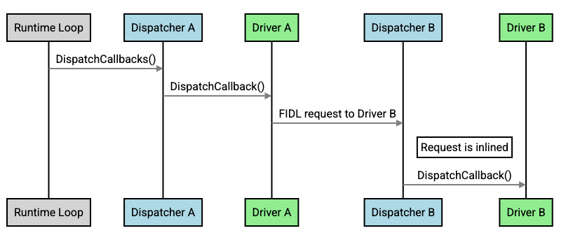
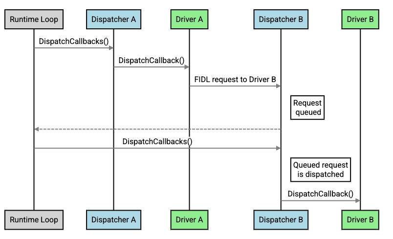
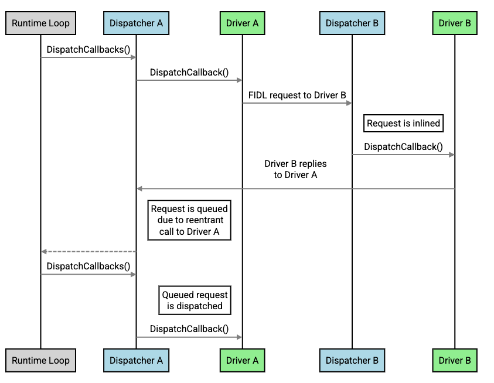

# Driver dispatcher performance

This page discusses the performance aspects of inlined and non-inlined calls
made by [driver dispatchers][driver-dispatchers].

Understanding the differences between
[inlined and non-inlined calls](#inlined-and-non-inlined-calls) can help
optimize a driver's responsiveness and overall system performance of Fuchsia.
This page identifies the [conditions](#conditions-non-inlined-calls) where
calls cannot be made inlined, along with their performance implications.
Additionally, it suggests
a [debugging technique](#debugging-non-inlined-calls) for investigating
non-inlined calls.

## Inlined and non-inlined calls {:#inlined-and-non-inlined-calls}

When a dispatcher needs to [“call into a driver”][call-into-a-driver] (which
is to run the work on a thread on behalf of a driver), the dispatcher first
determines whether the call can be inlined or not. If not to be inlined,
the call is scheduled at a later point in time.

The key difference between these calls is the following:

- **Inlined**: The dispatcher immediately calls into the driver. A request from
  the sender is received by the receiver without returning to the runtime loop
  (see Figure 1).
- **Non-inlined**: The dispatcher schedules the call to occur on a future
  iteration of the runtime loop (see Figure 2).

Inlined calls are more efficient than non-inlined calls. For instance, an
inlined one-way channel call takes around 2 microseconds whereas a non-inlined
one-way channel call can take up to 10 microseconds.



**Figure 1**. Flow of an inlined call.



**Figure 2**. Flow of an non-inlined call.

## Conditions for non-inlined calls {:#conditions-non-inlined-calls}

A dispatcher does not make a call be inlined if any of the following
conditions apply:

- **The dispatcher allows blocking calls**.

  Calls are not made inlined if the target dispatcher has the
  [`ALLOW_SYNC_CALLS`][allow-sync-calls] option set. This is to prevent
  blocking a non-blocking dispatcher in the same call stack.

- **The dispatcher is synchronized and is not idle**.

  This condition only applies to
  [synchronized dispatchers][synchronized-dispatchers]. When calling into
  a driver, the driver runtime checks whether the dispatcher is idle.
  If it is not idle,  a call is not made inlined to avoid making
  a parallel call into a driver.

- **The call is from a thread that is not managed by the driver runtime**.

  A thread is not managed by the driver runtime when a driver has spawned
  their own thread using, for instance, the `std::thread` or `thread_create`
  method.

- **The channel associated with the FIDL receiving end is not ready**.

  FIDL transports send and receive messages using channels, either Zircon
  channels or driver transport channels. In order to receive a message, a wait
  needs to be registered on the channel by the FIDL layer (which is handled in
  the background by the FIDL bindings). If a wait is not registered by the time
  a message is received, the dispatcher cannot make the call be inlined.

- **The call is considered reentrant**.

  In Figure 3, when Driver A sends a FIDL request to Driver B, which is received
  inline, although Driver B immediately replies to Driver A, this message is
  considered [reentrant][reentrant] for Driver A. In this case, the dispatcher
  for Driver A makes a non-inlined call to send the reply from Driver B.

  Reentrancy checks apply to dispatchers regardless of which drivers they serve.
  For example, if a driver owns two dispatchers, sending and receiving messages
  between these two dispatchers is always considered reentrant and cannot be
  inlined.

- **The call is a FIDL request using the Zircon channel transport**.

  FIDL inlining is supported only with the [driver transport][driver-transport].
  Unlike Zircon channels, the driver transport channels are in-process only
  and they allow special inlining implementation in the driver transport
  channels logic.



**Figure 3**. Flow of a non-inlined call due to reentrancy.

## Debugging non-inlined calls {:#debugging-non-inlined-calls}

The `fdf_env_dispatcher_dump` function can help driver authors debug why some
calls are not made inline. This function logs the count and reasons for
non-inline calls, for example:

```none {:.devsite-disable-click-to-copy}
INFO: [my_driver.cc(212)] ---- Runtime Dispatcher Dump Begin ----
INFO: [my_driver.cc(212)] The current thread is not managed by the driver runtime.
INFO: [my_driver.cc(212)] Dispatcher to dump: TestBody (0x24a7614d4240) (driver 0x10)
INFO: [my_driver.cc(212)] Synchronized: true
INFO: [my_driver.cc(212)] Allow sync calls: false
INFO: [my_driver.cc(212)] State: running
INFO: [my_driver.cc(212)] Processed 5 requests, 3 were inlined
INFO: [my_driver.cc(212)] Reasons why requests were not inlined:
INFO: [my_driver.cc(212)] * The request would have been reentrant: 2 times
INFO: [my_driver.cc(212)] * Another thread was already dispatching a request: 1 times
INFO: [my_driver.cc(212)] No queued tasks
```

<!-- Reference links -->

[driver-dispatchers]: /docs/concepts/drivers/driver-dispatcher-and-threads.md
[call-into-a-driver]: /docs/concepts/drivers/driver-dispatcher-and-threads.md#dispatcher-operations
[allow-sync-calls]: /docs/concepts/drivers/driver-dispatcher-and-threads.md#synchronous-operations
[synchronized-dispatchers]: /docs/concepts/drivers/driver-dispatcher-and-threads.md#synchronized-and-unsynchronized
[reentrant]: /docs/concepts/drivers/driver-dispatcher-and-threads.md#reentrancy-guarantees
[driver-transport]: /docs/development/languages/fidl/tutorials/cpp/topics/driver-transport.md

