<!-- mdformat off(templates not supported) -->


# {{ rfc.name }}: {{ rfc.title }}
{# Fuchsia RFCs use templates to display various fields from _rfcs.yaml. View the #}
{# fully rendered RFCs at https://fuchsia.dev/fuchsia-src/contribute/governance/rfcs #}
<!-- SET the `rfcid` VAR ABOVE. DO NOT EDIT ANYTHING ELSE ABOVE THIS LINE. -->

<!-- mdformat on -->

<!-- This should begin with an H2 element (for example, ## Summary).-->

## Summary

One of the key problems of system power management is supporting the transitions
of various system elements — a term we use plainly to refer to things with a
state, hardware and software alike — to different states while properly managing
interdependencies between those states. This proposal specifies a model called
the Fuchsia Power Topology that can be implemented to solve this problem, while
simultaneously offering solutions to related problems in attribution and
observability. This work is focused on establishing a conceptual framework with
rigorously-defined terminology; future RFCs will address designs more closely
related to implementation.

## Motivation {#motivation}

### The state management problem {#state-management-problem}

This proposal originates from the need to support system suspend/resume
operations in Fuchsia, as described in [RFC 230](0230_suspend_to_idle.md).

A major task of system suspension is ensuring that all hardware elements have
been placed in the appropriate low-power states before the CPUs stop executing
instructions. Superficially, this might seem like a dependency-management
problem one layer deep: the "active" states of hardware elements depend on the
active state of the CPUs, and so hardware elements must be taken to suspended
states before CPUs are suspended.

However, hardware elements may depend on each other; for example, devices must
be suspended before buses can be de-powered. Meanwhile, devices may have
multiple states that are desirable to use during system suspension under
different conditions, such as a low-power state that should be used if the
device is to serve as a wake source and a fully-off state if it is not.
Meanwhile, the associated state management problems are not isolated to system
suspension. Hardware elements may be taken to low-power states while CPUs are
active, such as when a phone is placed in airplane mode, requiring that certain
radios be turned off.

These factors make it valuable to create a framework that supports transitions
of interdependent states. As power management is the main reason such
transitions are necessary, this responsibility falls to Fuchsia's Power
Framework. We introduce the term "power topology" to somewhat flexibly refer to
both the dependency graph at the heart of this framework and the framework
itself.

In developing the power topology, we found that the concepts required to manage
state dependencies between hardware elements extend naturally to software
elements, which can provide higher-level abstractions on top of hardware or
naturally describe the enabled/disabled state of user-facing features. In
particular, by explicitly capturing the dependencies necessary to support
user-facing features, we establish a natural means to enforce _on-demand
utilization_ such that dependencies are only utilized when needed, and to
provide _attribution_ of utilized resources to the features that require them.
Attribution to components is of interest as well, but features are more closely
tied to the reasons power is utilized and thus call for attribution at a
sub-component level.

The concepts we establish to enforce demand-based state changes will allow the
power topology to encode not only the states supported by elements across the
system but the rules for driving state changes. This will create a powerful tool
for product developers and systems engineers, who will be able to review
systemwide behaviors and propose functional changes via the topology itself
rather than source code.

### Why a new topology?

Fuchsia already has two significant topologies used to describe drivers and
components. However, neither of these readily accommodate solutions to the state
management problem. As such, we develop the power topology in its own right,
with the expectation that we will regularly revisit the component and driver
graphs to clarify its role in relation to them.

For ease of reference, we briefly review the existing topologies.

The [component topology](/docs/concepts/components/v2/topology.md) describes two
things: the parent/child relationships between component instances and the
capability routing graph. It is a tree describing the hierarchy of component
instances, and capabilities are mapped into a DAG on top of that tree. If a
component needs access to a capability from another subtree, the capability is
routed through its parent.

The driver manager also tracks its own [node
topology](/docs/concepts/drivers/drivers_and_nodes.md) as a DAG. In the driver
framework, a node is an abstraction of a device, and drivers bind to nodes to
use their associated resources, such as access to MMIO registers. Drivers are
components in the component topology, but they are flattened into collections.
The reason for this structure is that the component topology does not have a way
to represent nodes without a driver bound to them, and nodes may have multiple
parents (these are called composite nodes) which is not allowed by the tree
structure of the component topology.

## Stakeholders

_Facilitator:_

Adam Barth <abarth@google.com>

_Reviewers:_

-   Power: Kyle Gong <kgong@google.com>
-   Power: Michael Brunson <mbrunson@google.com>
-   Driver Framework: Justin Mattson <jmatt@google.com>
-   Driver Framework: Harsha Priya NV <harshanv@google.com>
-   Zircon Kernel: Nick Maniscalco <maniscalco@google.com>
-   Platform Drivers: Andres Oportus <andresoportus@google.com>
-   Component Framework: Gary Bressler <geb@google.com>

_Consulted:_

-   David Gilhooley <dgilhooley@google.com>
-   Corey Tabaka <eieio@google.com>
-   Filip Filmar <fmil@google.com>
-   Guocheng Wei <guochengwei@google.com>
-   HanBin Yoon <hanbinyoon@google.com>
-   Eric Holland <hollande@google.com>
-   Mukesh Agrawal <quiche@google.com>
-   John Wittrock <wittrock@google.com>

_Socialization:_

This design was initially socialized via a [Google-internal design
document][power-topology-design-doc]{:.external} with reviewers from the Power
Framework, Component Framework, Driver Framework, Drivers, and Zircon teams. It
has been further refined during similar design processes for [Power
Broker][power-broker-design-doc]{:.external} and [System Activity
Governor][sag-design-doc]{:.external}, both of which will be the subjects of
forthcoming RFCs.

## Requirements {#requirements}

### Orderly dependency management {#orderliness-requirement}

As described [previously](#state-management-problem), one of the key problems of
system power management is the management of state changes of different system
elements in a way that respects dependencies between those states. Examples of
the implications of such dependencies are:

-   A USB device can only be turned on once its bus is powered.
-   A clock can only operate at a given frequency once the voltage rail
    supplying it is at a sufficiently high voltage.
-   A video streaming app can start streaming a video only when there is an
    active network connection.

In general, a given system element E may have a collection of states
S<sub>0</sub>, S<sub>1</sub>, S<sub>2</sub>, ... that it can occupy. For E to
correctly occupy a given state S<sub>i</sub>, all of S<sub>i</sub>'s
dependencies must be satisfied.

We call an operation **orderly** if it preserves dependencies of all
system element states at all times. In particular, for each element E with
candidate state S<sub>i</sub>:

-   E only enters S<sub>i</sub> once all dependencies of that state are
    satisfied.
-   If one of S<sub>i</sub>'s dependencies is to be broken, E must first exit
    S<sub>i</sub>.

The Power Framework must support orderly state transitions for participating
system elements.

When state transitions cannot be performed in an orderly fashion, the Power
Framework should ensure that elements are placed in well-defined states, and
that the number of elements performing disorderly changes is minimized.

### Attribution {#attribution-requirement}

System elements may occupy a variety of states, some of which are higher-power
than others. When elements occupy higher-power states, the Power Framework must
make it possible to determine why this is the case.

### Efficiency {#efficiency-requirement}

System elements should be driven to the lowest-power state to which Power
Framework can attribute a reason for operation. Framework users must have
straightforward ways to drive elements to higher-power states as needed, but
they may need to introduce new attribution reasons to do so.

### Observability {#observability-requirement}

The Power Framework must enable observation of the states of system elements
that framework users consider relevant to power consumption.

### Performance {#performance-requirement}

Given system elements that are capable of executing state transitions in a way
that meets a set of product-requirements, the Power Framework must adequately
support them in doing so. This roughly decouples into two concerns:

-   _Don't inhibit local performance_. The Power Framework must not introduce
    excessive latency to the state transitions of individual system elements.
-   _Support optimization of non-local performance_. The Power Framework should
    support optimization of state transitions that span multiple elements.

    -   For example, suppose the graphics and audio subsystems proceed to
        lower-power states in parallel during a system suspend operation. Power
        Framework should indicate that they act in parallel and provide insight
        into which takes longer, so latency optimization of the system suspend
        operation can focus on one or the other appropriately.

### Exclusions {#exclusions}

The power topology invites consideration of a very large problem space. This
proposal specifically does not address the following topics:

-   _Detailed specification of Power Broker_. This RFC must establish some basic
    aspects of [Power Broker](#power-broker) to develop the topology model.
    However, it endeavors to leave as much as possible regarding Power Broker's
    specification to the forthcoming Power Broker RFC. Power Broker will
    implement behavior beyond the model that is detailed in this document, and
    we wish to provide it all the flexibility it needs in doing so.
-   _First-class error handling_. The topology model developed in this document
    provides no explicit means for handling state transition errors. This
    exclusion is an extension of the preceding item; it makes no implications
    regarding Power Broker's error-handling and seeks primarily to impose no
    constraints.
-   _Bad actors_. The division of responsibilities between [Power
    Broker](#power-broker) and [element owners](#element-owners) will eventually
    require consideration of element owners that behave poorly and in unexpected
    ways.
-   _Deadline-backed state transitions_. As a means of enforcing timely
    systemwide actions, it is natural to consider application time limits to
    individual state transitions.

These issues will be given further consideration as use cases provide specific
requirements.

## Design

The design covered here establishes the model underlying the power topology,
independent of any particular interfaces or implementation. For practical
purposes, several forthcoming RFCs will also be of importance to developers
intending to integrate their subsystems with the power topology:

-   The Power Broker RFC will address the interfaces involved in administering
    the power topology and the component that implements them.
-   The System Activity Governor RFC will describe the power topology's
    integration point with the system suspend/resume process.
-   The Power-Enabled Drivers RFC will address driver-specific aspects of
    integration.

The topology model itself, though, is sufficiently complex for a dedicated
document. This RFC is intended to ratify the concepts in a coherent conceptual
framework, creating a foundation on which the other RFCs can build, and upon
which stable [documentation](#documentation) can be developed to assist Power
Framework users with integration.

### Power topology and core concepts

The main functional need driving this design is the [orderliness
requirement](#orderliness-requirement) outlined above. First, we need to
establish what kinds of system elements may participate in our model, what types
of states they may occupy, and what dependencies those states may express
through the power topology. Only then can we specify how those states will be
controlled in an orderly fashion.

#### Power elements

**Power elements** are the basic stateful entities in this design. A power
element has a finite number of states that it may occupy, and at any given time
it occupies exactly one of these states. It is sometimes useful to think of
power elements as generalized device models, but they can also be considered
simply as containers for states.

A given hardware device may correspond directly to a single power element, but
it may also be modeled using multiple power elements that describe different
device states. For example, it might be possible to separately configure a touch
sensor's sample rate and capacity for position tracking; the sensor's driver
could expose independent "sample rate" and "position tracking" elements as a
result.

Power elements can also be used to model more abstract concepts, such as the
overarching state of a subsystem that spans several pieces of hardware or the
enabled/disabled state of a user-facing software feature.

#### Power levels

**Power levels** are the states that a power element is allowed to occupy. A
**power level schema** consists of the collection of power levels that a given
power element may occupy, along with metadata to be described shortly.

Power Framework assumes that the levels in a schema abide by several
constraints. Framework users are responsible for ensuring that, upon specifying
a schema for a power element, these constraints accurately reflect the
properties of the entity being modeled. These constraints are:

1.  They can be ordered by increasing power consumption. (There are many ways to
    measure power; for current intents and purposes, a context-specific
    definition of "typical" power consumption suffices.) The remaining
    constraints are expressed in terms of this ordering.
2.  Dependencies are cumulative: For a given element, any resources that are
    required for correct operation at level L are also required by any level M >
    L.
3.  Functionality is cumulative: For a given element, any functionality provided
    by level L is also provided by any level M > L.

    -   This requirement eliminates the possibility of conflicts between
        dependents of a power element. For example, if one dependent requires
        the functionality of the Nth level and another requires that of the
        (N+1)st, the element can satisfy both by operating at the (N+1)st.

A power level schema then consists of:

-   A label for each power level in the schema.
-   The ordering of the levels by increasing power consumption.

##### Examples {#power-level-examples}

For purposes of illustration, we will use string labels and represent sort order
with vertical lists ordered from bottom to top. (The details of how power levels
will actually be represented will be covered in the Power Broker RFC.)

Three possible power level schemas are illustrated here:

<!-- I'm using HTML table syntax to get tables to render side-by-side. Embedding
Markdown tables in one row of an outer HTML table does not render as expected
when using `fx doc-preview`. -->

<table><tr>
<td>
<table>
  <th> Binary on/off scheme </th>
  <tr> <td>On</td> </tr>
  <tr> <td>Off</td> </tr>
</table>
</td>

<td>
<table>
  <th> Ternary scheme with low-power mode </th>
  <tr> <td>Fully on</td> </tr>
  <tr> <td>Low-power</td> </tr>
  <tr> <td>Off</td> </tr>
</table>
</td>

<td>
<table>
  <th> ACPI D-states without D0ix </th>
  <tr> <td>D0</td> </tr>
  <tr> <td>D1</td> </tr>
  <tr> <td>D2</td> </tr>
  <tr> <td>D3hot</td> </tr>
  <tr> <td>D3cold</td> </tr>
</table>
</td>
</tr></table>

Of particular note, power levels are ordered using the opposite convention of
ACPI power states. This choice eliminates an unfortunate piece of ambiguity in
casual wording. With the ACPI convention, expressions like "lower power state"
have two directly conflicting interpretations, depending on whether "lower" is
taken to apply to power consumption (corresponding to a higher index in the sort
order) or to the index in the sort order (corresponding to higher power
consumption). Expressions like "lower power level" do not suffer from this
ambiguity.

Not all power elements will be able to use a common power level schema that is
shared with other elements. For example, one might define a power element that
specifies the minimum frequency at which a CPU will run, in which case the power
levels correspond to supported frequencies for the CPU in question.

##### Uses and limitations

Power level schemas are a useful starting point for representing element states
for a variety of reasons:

-   They cleanly express common patterns, like those shown
    [above](#power-level-examples).
-   They provide a way to capture dependencies between
    significant numbers of states in ways that aggregate rather than requiring
    cumbersome repetition.
-   They can be used in a way that is conflict free -- a property that cannot be
    expected in all circumstances but should be utilized wherever possible.

A single power element and power level schema will not suffice to describe all
scenarios of interest to Power Framework users. For example, disjoint operating
modes of a single device (as a simple but out-of-context example, consider a
heat pump that can heat or cool a room) cannot be accurately modeled as a single
power element.

However, power level schemas can be used as building blocks to describe more
complex systems. Best practices for doing so are beyond the scope of this RFC;
that topic will be covered in upcoming [documentation](#documentation).
Framework users may also file a bug with the Power Framework team via the
[Fuchsia > Power
component](https://issues.fuchsia.dev/issues?q=componentid:1585130).

#### Operability and dependencies

At any given point in time, based on current system conditions, a power element
will be able to function correctly at a subset of its power levels. These are
its **operable** levels. This subset always consists of all levels less than or
equal to a maximum operable level, denoted max_operable_level(E) for element E.

A **power level dependency** is a condition that indicates how the operable
levels of one power element are related to the current power level of another
element. A power level dependency expresses that for a child element C to
operate at or above level L, it requires a parent element P to operate at a
required level RL. More precisely, a dependency of (C, L) on (P, RL) means that:

-   If current_level(P) < RL, then max_operable_level(C) < L.

Equivalently, this condition can be stated as:

-   max_operable_level(C) ≥ L only if current_level(P) ≥ RL.

Each dependency of (C, L) establishes a necessary condition for L to be
operable. A dependency may be described as "satisfied", "fulfilled", etc. based
on the state of its associated condition.

Note also that for any level K < L, each dependency of (C, K) creates a
necessary condition for the operability of L. In particular, the operability of
(C, L) may place a requirement on a parent element even though (C, L) itself
does not depend directly on that element. We call the set of all elements with
such requirements the **required elements** of (C, L). For any element P in this
set, there is a **minimum required level** for (C, L) to be operable; we denote
this min_required_level(P; C, L).

Aggregating over all required elements, the following collection of necessary
conditions must be satisfied for L to be operable:

-   current_level(P) ≥ min_required_level(P; C, L) for all P ∈
    required_elements(C, L).

When these conditions are satisfied, we say that L is **nominally operable**. L
may not be operable even if it is nominally operable; local conditions, such as
(potentially unobserved) hardware errors, may prevent C from operating at L even
when all relevant power level dependencies have been satisfied. Nominal
operability should be viewed as the way the power topology attempts to model
true operability. While discrepancies between the two concepts are inevitable,
the power topology will be able to function best when element designers keep
such discrepancies to a minimum.

One power element may have multiple power level dependencies on another element.
The set of all such level dependencies for a fixed parent and child form a
**power element dependency**. We will say that C depends on P if there is a
dependency from at least one of C's levels to one of P's.

#### The power topology

As a formal entity, the **power topology** is the multi-edged graph with power
elements as nodes and power level dependencies as directed edges. We
additionally impose the following constraints on this graph:

1.  _Acyclicity_: The power topology is acyclic.

    -   In particular, parent/child relationships behave as one would expect; if
        element C depends on element P, then P may not depend on C.

2.  <a name="min_level_operability">_Minimum level operability_</a>: The minimum
    power level of any power element must always be operable, regardless of the
    current levels of other elements. Furthermore, it may have no power level
    dependencies.

    -   This condition refers to operability rather than nominal operability,
        and it ensures that each element always has at least one operable level.
        It must be enforced by the element owner.

    -   Allowing one element's minimum level to depend on another element's
        minimum level would have no impact on operability. But such dependencies
        would be functionally irrelevant, and allowing them would also require
        consideration of elements that are interdependent _only_ via their
        minimum levels.

The power topology may contain redundant power level dependencies. For example,
(C, L) may depend on both (P, RL<sub>1</sub>) and (P, RL<sub>2</sub>) where
RL<sub>1</sub> < RL<sub>2</sub>, even though the condition imposed by the
dependency on (P, RL<sub>2</sub>) is strictly stronger than the one imposed by
the dependency on (P, RL<sub>1</sub>). Such redundancies are considered harmless
in this proposal's model, but they may receive special consideration upon
implementation.

#### Examples and context

_Note: These examples are for illustration only. This RFC has no implications
regarding what must be modeled using power elements._

The most basic form of a power level dependency relates on/off states. In a very
simplified example, we might express that the USB bus must be on in order for a
USB device to be on as:

<a name="usb-example"></a>

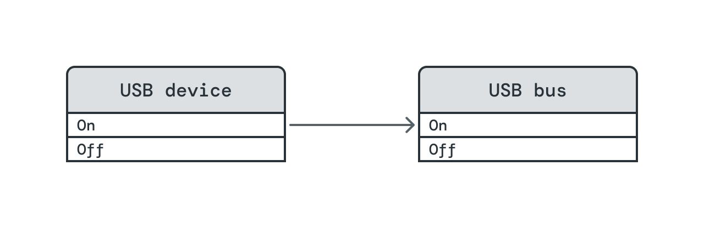

To handle the above dependency in an orderly way, the bus must be turned on
before the device is powered on, and the device must be turned off before the
bus is turned off.

The broader definition of a power level dependency accommodates more complex
relationships, such as the coupling between clocks and voltages during DVFS.
(DVFS is sufficiently time-sensitive that it will likely not be a good candidate
for power topology integration, but it serves as a useful example.) Suppose we
have a clock with the following DVFS table, listing supported frequencies and
their required voltages:

| Clock frequency | Voltage |
| --------------- | ------- |
| 1.6 GHz         | 900 mV  |
| 1.5 GHz         | 800 mV  |
| 1.4 GHz         | 700 mV  |

This table translates to power elements, levels, and dependencies as follows:

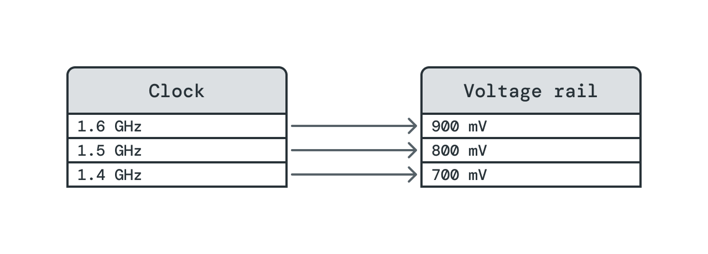

(Note that the dependency of (Clock Frequency, 1.4 GHz) on (Voltage, 700 mV)
would [not technically](#min_level_operability) be included in the topology, but
it is depicted for ease of comparison to the table.)

<a name="video-call"></a>

Power elements that represent things like software features or user-level
operational modes of a device may carry many dependencies to describe all the
resources that they need to function. In another simplified example, a video
call client's "Active" level might depend on the various hardware subsystems
required to conduct a video call:

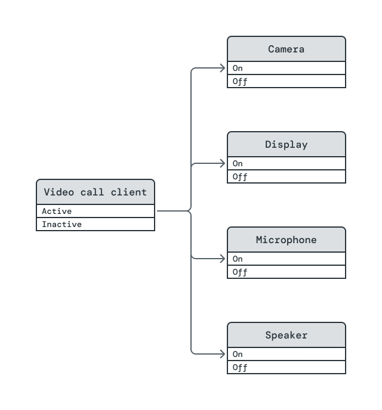

Finally, multiple child elements may depend on the same element. Here, we depict
a device that describes its power levels in terms of latency. Client A's Active
level requires low latency, while Client B's requires medium latency. The device
can satisfy both children's Active levels by operating at low latency.

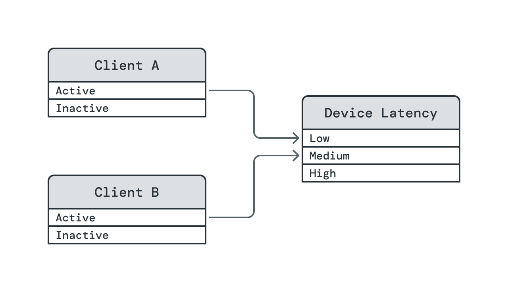

This example demonstrates an important property of power levels: they are
defined such that the needs of different clients cannot conflict.

#### Edge direction convention

As seen in the diagrams so far, we adopt the convention that edges in the power
topology go in the direction of dependency, from child to parent. It is probably
unavoidable for some discussions and intuitive terminology to be based on the
direction of power flow, from parent to child. For the time being, our intent is
to use the direction of dependency for all formal development, and we simply
advise readers to be aware of the issue.

### Power level administration

To specify how the power topology will be utilized on a real system, we next
need to define the parties involved administering the topology and individual
power elements.

#### Power Broker {#power-broker}

The power topology will be administered by a Power Framework component
called **Power Broker**. Power Broker will maintain a representation of the
entire power topology, including all power elements, their power level schemas,
power level dependencies, and current power levels. It will provide interfaces
for each element owner to update their elements' power levels at appropriate
times such that level changes are made in an orderly fashion whenever possible.

Power Broker's existence reflects a key assertion of this design: *the power
topology will be centrally administered*. We deem this necessary because:

-   Attempting to administer the topology locally would create substantially
    more opportunities for implementation errors in dependency management.
-   A central administrator has the systemwide visibility necessary to connect
    elevated power levels to the demand for power use, in service of the
    [efficiency requirement](#efficiency-requirement).
-   A central administrator has the authority to perform attribution in service
    of the [attribution requirement](#attribution-requirement).
-   A central administrator can maintain and report detailed telemetry to
    satisfy the [observability requirement](#observability-requirement), even
    if an individual subsystem provides no instrumentation.
-   Central administration creates the opportunity to clearly remove agency from
    element owners that should not have it. For example, it is generally
    preferred that drivers do not make decisions regarding the current power
    levels of their underlying hardware; that preference can be explicitly
    encoded by a driver forfeiting the ability to [lease](#lease-definition) a
    power element it owns.

Centralized administration does come at the expense of localized performance
costs, as the administrator introduces a party that must be aware of power
elements and their levels. Thus, performance must receive careful attention
throughout Power Broker's design and implementation. However, the global
perspective that Power Broker will support may allow it to offset its local
costs by providing opportunities for systemwide performance optimization.

#### Element owners {#element-owners}

Each power element is associated with a single **element owner**, the instance
of a component -- possibly a DFv2 driver -- that is responsible for managing it.
The owner registers the element with Power Broker, declares its power level
schema, defines its dependencies, and updates its power level at appropriate
times.

If necessary, ownership of an element may be delegated over the course of the
element's lifetime. This would most likely involve one component instance
serving as the owner for registration and configuration tasks, and another
receiving ownership for runtime administration.

The lifetime duration of a power element and its associated dependencies will be
addressed in the Power Broker RFC.

#### Types of power elements

Most power elements will be **managed**, meaning that their owners defer the
selection of power levels and the timing of changes to Power Broker. To notify
an element's owner of a necessary level change, Power Broker will send the owner
a **required level**. The owner makes the change and then notifies Power Broker
of the element's new **current level**.

Within the current model, we make a simplifying assumption. Upon being notified
of element E's required level RL, E's owner will always:

-    If RL is operable, update current_level(E) to RL.
-    If RL is not operable (e.g. a hardware error is discovered in the attempt
     to update E's current level), take an action that makes (E, RL) no longer
     nominally operable. (For example, an [error state
     element](#error-state-elements), could be used to specify the inoperability
     of (E, RL).

This is by no means a thorough treatment of possible error conditions. Rather,
it delegates development of error-handling to Power Broker (as noted in the
[exclusions](#exclusions)) while pointing to a means of proactive error handling
that is possible within this model's scope.

An element that is not managed is called an <a
name="unmanaged-element-definition">**unmanaged element**</a>. It cannot have
dependencies, and its owner simply reports its current level to Power Broker
whenever its level changes. Its current level affects the operability of any
elements that depend on it.

Such elements are necessary to describe states that are not software
controlled and can only be observed, like the state of a hardware switch
or the error state of a piece of hardware.

### Power level control

Via managed elements, Power Broker will be responsible for driving most power
level changes throughout the topology. To limit the design surface that is
addressed in this RFC, we will limit our attention to [steady-state
behavior](#steady-state-definition).

Power Broker's control scheme is designed to provide a balance between demand
for power usage and constraints that inhibit its use.

Conceptually, demand for power use arises from a device's functional
requirements. These requirements often vary dynamically, based on an
understanding of a user's current expectations of a device. A user may open an
application to fulfill a specific task, indicating that certain power elements
associated with that application need to operate at elevated power levels.
Alternatively, a device may sense activity that indicates the user is nearby and
is likely to interact with it soon, suggesting that it should enter a mode in
which it can respond at low latency. Demand is even present when the application
processor is inactive based on the user's expectations for what interactions
will wake the device - speaking a hotword, clicking a mouse, tapping a screen,
etc. To express the entry of demand to the power topology, we will introduce an
object called a [_lease_](#lease-definition).

Constraints, meanwhile, can arise in two different ways. In one case, states
that are not software-controllable may directly inhibit power usage; this is
modeled by [unmanaged elements](#unmanaged-element-definition). In the other,
the system may require a means to express when power levels should or should not
be raised to fulfill demand expressed by a lease; this need is captured by
[_dependency fulfillment policies_](#fulfillment-policy-definition).

Altogether, these concepts will allow us to specify the steady states to which
Power Broker guides the system while leaving nuances required for time-dependent
aspects to the Power Broker RFC.

#### Steady states

At any given point in time, a certain set of factors determine the <a
name="steady-state-definition">**steady state**</a> of the managed elements,
i.e. the power levels to which Power Broker will guide them as long as the
determining factors remain unchanged. Within this RFC's scope, we describe Power
Broker's control scheme in terms of the steady states. Doing so allows us to
introduce the key concepts involved while limiting the amount of detail
required.

#### Steady state determinants

The determinants of the steady state are:

1.  Topology structure, i.e. power elements and dependencies.
2.  Leases.

    -   A <a name="lease-definition">**lease**</a> is a grant for a managed
        element to have all of its dependencies for a given power level
        fulfilled. A lease for element-level (C, L) is considered to require
        (C, L) itself, and transitively every element-level required by (C, L).

        A lease indicates that there is demand for a particular element-level
        arising from a source outside of the power topology. Leases establish
        the reasons for power use described in the [efficiency
        requirement](#efficiency-requirement).

3.  Current levels of unmanaged elements.

Any changes to these determinants will lead to re-evaluation of the steady
state.

#### Evaluation of the steady state

The key factor in determining the steady state is evaluating which leases will
be **fulfilled**, meaning that all dependencies of the leased element-level are
satisfied.

Power Broker will handle leases in an all-or-nothing fashion. If there is a
lease on (C, L), but Power Broker cannot or will not satisfy all dependencies of
(C, L), then it will not work to satisfy any dependency of (C, L), unless doing
so contributes to a different lease that is fulfillable.

To decide whether to fulfill a lease, Power Broker needs to determine both if it
_can_ fulfill the lease and if it _should_. The question of "can" is a matter of
functional requirements and is addressed by the levels of unmanaged elements.
Answering the question of "should" requires a new concept to specify whether or
not Power Broker will actively work to satisfy a dependency on a managed
element.

To this end, we introduce two possible <a
name="fulfillment-policy-definition">**fulfillment policies**</a> for power
level dependencies: **strong fulfillment** and **weak fulfillment**. A
dependency can be strongly-fulfilled only if its required element is managed,
whereas dependencies on managed and unmanaged elements alike may be
weakly-fulfilled.

Fulfillment policies aggregate to paths of dependencies as well. A path of
dependencies is strongly-fulfilled if every dependency in the path is
strongly-fulfilled; otherwise it is weakly-fulfilled.

Now, given a fixed set of steady state determinants, we are equipped to specify
when a lease will be fulfilled. A lease on (C, L) is fulfilled in the steady
state if and only if for every element-level (P, RL) that (C, L) depends on via
a weakly-fulfilled path:

-   If P is unmanaged, then current_level(P) ≥ RL.
-   If P is managed, then (P, RL) is required by another lease that is fulfilled
    in the steady state and depends on it via a strongly-fulfilled path.

Once steady-state fulfillment of leases is determined, the steady state power
level of any managed element C is simply the largest level required by a
fulfilled lease, or min_level(C) if no fulfilled lease requires one of C's
levels.

#### Orderliness

Power Broker will guide the system towards its steady state by performing
operations in dependency order to the greatest extent possible. Of particular
note, if all steady state power levels are greater than or equal to current
power levels, then progress towards the steady state is guaranteed to be
orderly.

Disorderly changes are possible under some circumstances when power levels
decrease. To describe such situations, we introduce two **termination policies**
for power level dependencies: **orderly-on-termination** and
**disorderly-on-termination**. Any dependency on a managed element is
orderly-on-termination, while any dependency on an unmanaged element is
disorderly-on-termination.

Like fulfillment policies, termination policies aggregate to paths of
dependencies. If all dependencies in a path are orderly-on-termination, then the
path is orderly-on-termination. Otherwise, it is disorderly-on-termination.

If (E, L) depends on (M, RL) via an orderly-on-termination path, then Power
Broker will ensure, to the extent possible, that current_level(E) is reduced
below L before current_level(M) is reduced below RL. Conversely, if (E, L)
depends on (U, RL) via a path that is disorderly-on-termination, this document's
model provides no guarantees regarding the sequencing of level changes along the
path should current_level(U) be reduced below RL.

Describing the disorderly case more concretely in terms of unmanaged elements,
consider a disorderly-on-termination dependency of (E, L) on (U, RL) where U is
necessarily unmanaged. If current_level(U) is reduced below RL, this event is
outside of Power Broker's control. There is no opportunity to drive
current_level(E) lower than L in advance; Power Broker must drive it to a lower
level reactively. Because transitive dependencies on (U, RL) are also broken as
soon as U's current level decreases, there is no clear ordering of level changes
to impose as the system is driven to its new steady state.

#### Dependency types

The formal descriptions above give rise to three distinct types of dependencies,
which we assign names as follows:

| Dependency type | Fulfillment policy | Termination policy        |
| --------------- | ------------------ | ------------------------- |
| Basic           | Weak               | Disorderly                |
| Opportunistic   | Weak               | Orderly                   |
| Assertive       | Strong             | Orderly                   |

A basic dependency is always of a managed element on an unmanaged element,
whereas an assertive or opportunistic dependency is always of one managed
element on another managed element.

#### Examples

##### Unmanaged element {#unmanaged-element-example}

This example demonstrates the use of an unmanaged element on a system with a
hardware mute switch. The elements are as follows:

-   Mute Switch: When Mute Switch is Disengaged, the system's microphone
    operates normally. When it is Engaged, the microphone's clock is pinned, so
    the signal it provides is useless.

-   Input Stream: This represents the stream of incoming data from the
    microphone that the audio subsystem delivers to applications. Its Active
    power level carries a basic dependency on (Mute Switch, Disengaged).

-   Audio Processor: This element belongs to an application that processes
    incoming microphone data for an unspecified purpose.

-   System Activity: This element abstractly represents the breadth of task
    processing that the system will allow. When this element is High, the system
    will process a wide variety of tasks; when it is Low, the system will
    process tasks much more selectively.

<!-- The content below renders using pagination on the Fuchsia devsite (see
https://developers.google.com/devsite/reference/widgets/pagination) but not on
Gitiles. -->

Steps:
<devsite-pagination container="unmanaged-element-demo"
                    elements="div"
                    elements-per-page="1">
</devsite-pagination>

<section class="unmanaged-element-demo">
<div>


Initially, a lease on (Audio Processor, Active) holds all managed elements at
elevated power levels.
</div>

<div>
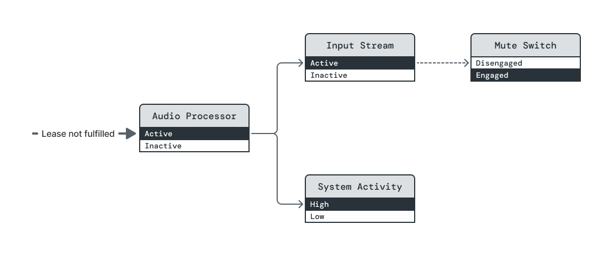

The mute switch is toggled, and Mute Switch's power level is immediately
changed to disengaged. The dependencies of both (Input Stream, Active) and
(Audio Processor, Active) are now broken.
</div>

<div>
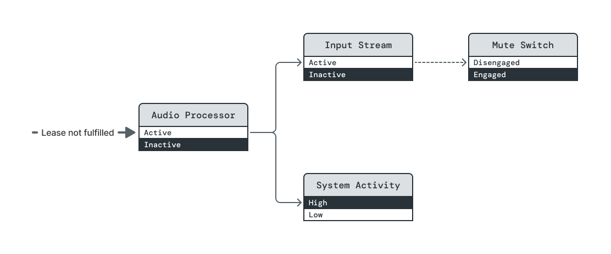

Power Broker immediately drives both Input Stream and Audio Processor to their
Inactive power levels. There is no specified ordering because both elements'
Active power levels already have unsatisfied dependencies.
</div>

<div>
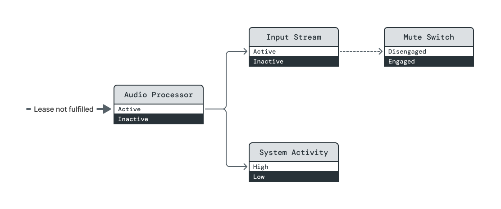

With Audio Processor's dependency no longer holding it Active, System Activity
is transitioned to Inactive.
</div>
</section>

##### Opportunistic dependency on a managed element {#opportunistic-managed-example}

In this example, two features require the System Activity element to be at its High
level in order to run. High Priority Feature's dependency is assertive, so System
Activity will be raised to High if required by a lease on (High Priority Feature,
Active). But Low Priority Feature's dependency is opportunistic, so it can only be
raised to Active once a lease on High Priority Feature raises System Activity to
High.

<!-- The content below renders using pagination on the Fuchsia devsite (see
https://developers.google.com/devsite/reference/widgets/pagination) but not on
Gitiles. -->

Steps:
<devsite-pagination container="opportunistic-lease-demo"
                    elements="div"
                    elements-per-page="1">
</devsite-pagination>

<section class="opportunistic-lease-demo">
<div>


<br>
There is a lease on (Low Priority Feature, Active), but Power Broker will not
satisfy it because the dependency on (System Activity, High) is opportunistic.
</div>

<div>
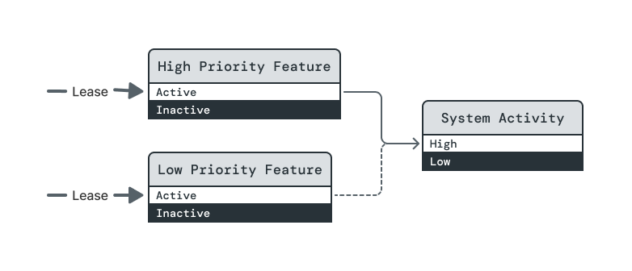

<br>
A lease is taken on (High Priority Feature, Active). This changes the steady state.
</div>

<div>
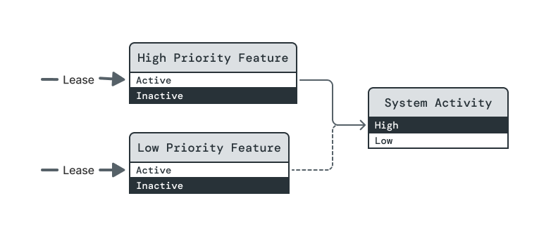

<br>
System Activity is raised to High.
</div>

<div>
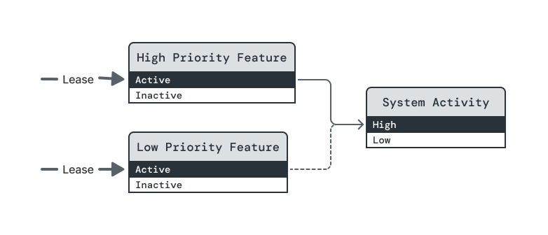

<br>
In no particular order, both feature levels are raised to Active, fulfilling both
leases.
</div>

<div>
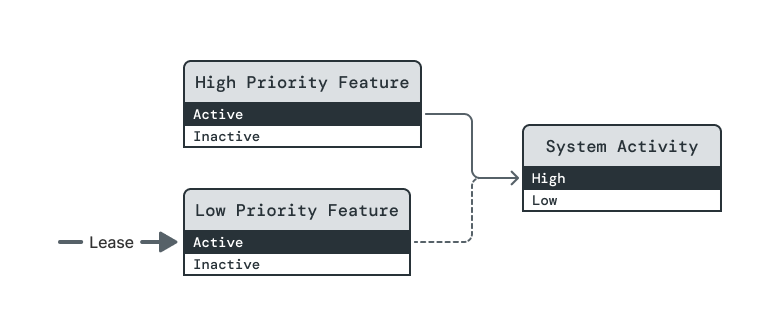

<br>
The lease on (High Priority Feature, Active) is dropped. In the new steady
state, the lease on (Low Priority Feature, Active) will no longer be fulfilled.
</div>

<div>
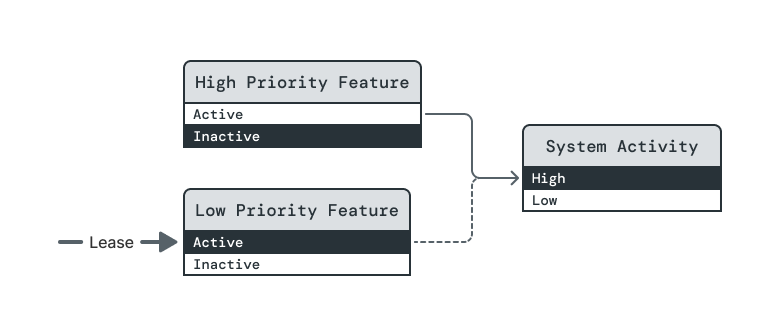

<br>
High Priority Feature is lowered to Inactive. (Note: This RFC does not guarantee
that this state change happens before Low Priority Feature's level is reduced.)
</div>

<div>
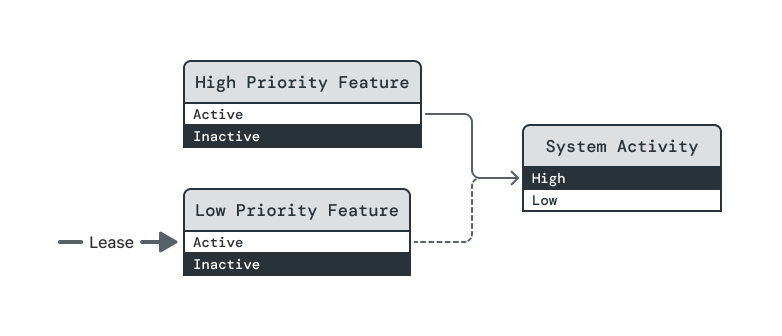

<br>
To maintain orderliness, System Activity remains High until Low Priority Feature is
lowered to Inactive.

This step highlights a property of opportunistic dependencies that many people
find surprising. Opportunistic dependencies differ from assertive dependencies
in how they are fulfilled, but Power Broker treats both dependency types equally
when ensuring orderliness of power-down sequences.
</div>

<div>
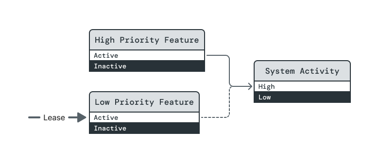

<br>
System Activity is finally reduced to Low.
</div>
</section>

##### Error state elements {#error-state-elements}

An element owner can model error states by using an unmanaged element that
inhibits the operability of certain power levels. The diagram below illustrates
two possible error elements for an element E with levels L<sub>0</sub>,
L<sub>1</sub>, L<sub>2</sub>, L<sub>3</sub>.

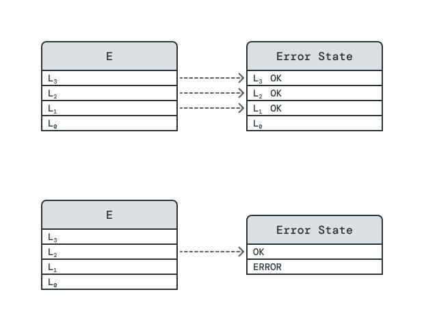

In the top scenario, the error element's levels mirror E's directly. If
current_level(Error State)\=\="L<sub>i</sub> OK", then L<sub>i</sub> is the
maximum level at which E can operate. In the bottom scenario, a more concise
error element inhibits E's operation at L<sub>2</sub> or L<sub>3</sub> if
current_level(Error State)\=\=Error.

This mechanism only serves to disable a contiguous block of levels at the top of
an element's schema. It is possible to use other mechanisms to disable levels
above which at least one level remains operable, but we would like to carefully
examine use cases as they arise.

### Attribution

Power Broker will support the attribution of current power levels to the leases
that they fulfill. Should it prove useful to do so, Power Broker will support
differentiation between leases that assertively require a given level and those
that opportunistically require it.

### Observability

Power Broker will expose information about power elements, including their power
level schemas and their dependencies, via Fuchsia's established diagnostic
facilities. It will furthermore maintain a record of leases and power level
transitions over some suitable, likely configurable lookback window.
Altogether, this information will facilitate inspection of the topology's state
at the time of a query, while also enabling future tooling to provide playback
of the topology's recent history.

### Configuration

Many aspects of the power topology are straightforward to capture by static
configuration. For example, the [USB example](#usb-example) presented earlier
via diagram could instead be described as follows:

```java
    [
        {
            name: "USB Bus",
            levels: ["Off", "On"],
        },
        {
            name: "USB Device",
            levels: ["Off", "On"],
            dependencies: {
                "On": ("USB Bus", "On")
            },
        }
    ]
```

Additional complexity arises when elements must be identified across component
boundaries. Techniques for making static configuration straightforward will be
investigated in cooperation with the Component Framework team.

### Future topics

#### Transition latency support

In the longer term, the power topology is intended to provide a framework for
understanding and optimizing the latencies of system state transitions. Power
element definitions will establish a canonical location to encode expectations
for local transition latencies, i.e. the time required to change an element's
level once all dependencies are satisfied. Local element latencies will not be
required, but they can be added as a given system matures.

Applications of local latencies include:

-   Semi-static analysis (e.g. by capturing the topology configuration at
    runtime) of latencies of composite operations that span many elements.
-   Runtime tracking of observed latencies and reporting on departures from
    expectations.
-   Reporting of latency estimates to clients to support operations with
    aggressive timing requirements.

#### Other types of states and dependencies {#other-types-of-states}

Power levels and the type of dependencies we have introduced are a useful
starting point for representing element states for a variety of reasons. They
provide a way to capture dependencies between significant numbers of states in
ways that aggregate rather than requiring cumbersome repetition. They
furthermore can be utilized in a way that is conflict free -- a property that
cannot be expected in all circumstances but should be utilized wherever
possible.

As the power topology evolves, it may be useful and/or necessary to support
other kinds of states and dependencies. For example:

-   A sensor's firmware might be implemented to support a set of disjoint
    operating modes, each of which is optimized to satisfy different
    requirements, but which do not abide by a scale of strictly increasing
    functionality and power use. While such a sensor might be described by one
    binary power element for each mode, we might instead introduce a new type of
    state schema that can describe all modes simultaneously while including
    rules to resolve conflicts between competing clients.
-   Some types of hardware, like GPUs, may have their power levels chosen based
    on simultaneous load requirements of multiple clients. It might be possible
    for the power topology to support dependencies that capture such load
    requirements and accumulate them in generic ways.

Such developments are speculative at this time; they should be revisited as
necessary throughout initial subsystem integrations with the power topology.

## Implementation

Implementing the power topology itself and utilizing it throughout Fuchsia is a
large undertaking. There are several centralized pieces of work that will be
widely used and therefore will require significant refinement past their initial
implementations. Meanwhile, Fuchsia subsystems have had modest support for
power management to date, and in many cases their developers will need develop
appropriate power management strategies concurrent with mapping those strategies
onto the power topology.

It is helpful to think of the development strategy in distinct phases, some of
which are historical. In Phase 1, core functionality was developed in relative
isolation, followed by a small number of integrations in Phase 2 to demonstrate
key use cases and enable end-to-end testing of system suspend/resume. Equipped
with the learnings first two phases, we are now laying a foundation in Phase 3
that will enable more integrations and lead to a stable development cycle as
described in Phases 4+.

<a name="phase-1">_Phase 1 (historical): Core functionality_</a>

-   Power Broker administers the power topology.
-   System Activity Governor defines and administers elements that support
    system suspend/resume operations.
-   Driver Framework supports integration of drivers with Power Framework.
    (Power Framework capabilities will be routed to non-driver components via
    standard means, requiring no special support.)

<a name="phase-2">_Phase 2 (historical): Proof-of-concept Power Framework
integrations_</a>

-   Initial integration with a driver that places hardware in lower- and
    higher-power states.
-   Initial integration with a driver that supports a wake source.
-   First usage in end-to-end suspend/resume workflows.

<a name="phase-3">_Phase 3 (current at time of writing): Scale-up_</a>

-   <a name="phase-3-rfcs">Ratify this RFC; propose and ratify RFCs for Power
    Broker, System Activity Governor, and Power-Aware Drivers.</a>
-   Characterize design constraints imposed by existing implementations, such as
    effective rate limits imposed by latency overhead.
-   Scope and design next set of subsystem integrations with Power Framework.
-   Develop and document best practices and design patterns.
-   Identify and implement small-scale improvements to assist with integrations
    (e.g. API improvements, straightforward optimizations).
-   Establish testing procedures and support libraries that incorporate
    domain-specific concerns of Power Framework.
-   Identify highest priorities for larger-scale feature additions and
    improvements. Possibilities might include:

    -   Support for tracking transition latencies.
    -   Performance improvements that require significant interface changes
        and/or backend implementation work.
    -   Streamlined Component Framework integration.

_Phase 4+: Further integrations and larger-scale improvements_

-   Integrate further subsystems.
-   Optimize existing integrations where appropriate.
-   Continue making small-scale improvements based on emerging needs.
-   Address highest-priority larger-scale improvements.
-   Identify larger-scale improvements, if any, to address in the next phase.

## Performance

Many aspects of performance will be a most appropriate to address in the [Phase
3 RFCs](#phase-3-rfcs), with Power Broker's being related most closely to this
proposal's conceptual buildup. However, in the current scope we can lay out some
general guidelines for thinking about performance implications.

### Local versus non-local performance

There is tension between the [local and non-local performance
requirements](#performance-requirement), as negotiating state changes with a
Power Broker will generally incur at least some cost that could be avoided by a
purely localized solution. However, purely localized solutions do not adequately
support the systems-level analysis needed to perform effective non-local
optimization.

### Identification of latency overhead

Power Broker's administration of the power topology will incur a certain amount
of latency overhead, particularly due to IPCs between element owners and the
broker. It will be important, however, to think critically about what cost is
truly overhead. Of particular note, some subsystems will inherently require
communication between their processes to implement any form of power management,
and integration with the power topology may accomplish that communication
indirectly through Power Broker.

### Size-driven latency overhead

Latency overhead due to operations like systemwide suspend and resume that are
relatively infrequent will primarily be impacted by the size of the subgraphs
that they affect. It will be important to understand the impact of subgraph
breadth, depth, and node count on such overhead.

### QPS-driven latency overhead

The primary driver of QPS to Power Broker is currently expected to be due to
suspend-blocking leases; the relevant power elements will be detailed in the
System Activity Governor RFC.

There is not yet a clear requirement for QPS that Power Broker must support.
Rather, some subsystem integrations might find themselves needing to block
suspension due to events that arrive at a sufficiently high rate that per-event
leases incur too much overhead. In such situations, alternative design patterns
must be pursued that consolidate the processing of multiple events under a
single suspend-blocking lease.

To aid in such assessments, estimation of per-lease latency overhead will be
important.

## Security considerations

Security should be considered in detail for the [Phase 3 RFCs](#phase-3-rfcs),
where proposals closer to concrete implementations will offer better-scoped
discussions. Here we outline the security issues that are inherent in any use of
the power topology.

### Power dependencies and capabilities

Because the power topology uses dependencies to raise power elements to higher
power levels, the ability to declare dependencies on a particular power element
is itself a privileged operation. As such, to conform to Fuchsia's security
model, dependency declaration should explicitly be capability-guarded at a
fairly granular level, at least per-element.

Thus far, Power Broker has adopted a centralized rights-management approach to
rigorously handle permissions based on currently-supported capability types.
This approach was chosen as a measured decision to more quickly enable a full
understanding of the power topology's implications than a concurrent evolution
of Component Framework will allow. In the longer term, Component Framework may
be able to represent capabilities associated with the power topology more
naturally, alleviating Power Broker of some security-related responsibilities
and supporting a smoother developer experience.

### Risks of central administration

The use of Power Broker as a central administrator exposes it to risks such as
DDoS attacks, which might prevent it from administering system-critical state
transitions, and circumventions of its permissions logic, which might give an
attacker the ability to manipulate hardware states maliciously.

## Privacy considerations

As detailed subsystem states will be tracked on-device, it will be important to
determine how to respect privacy concerns while leveraging this data in fleet
metrics. This issue will be most effectively considered in Phase 4 or after,
once we can concretely demonstrate data that Power Broker might export for a
significant number of subsystems.

## Testing {#testing}

[Phase 1](#phase-1) has incorporated unit testing of all functionality
developed, as well as integration testing for Power Broker with fake clients and
integration testing coupling Power Broker with System Activity Governor.

[Phase 2](#phase-2) has added end-to-end suspend/resume testing and support for
non-hermetic driver tests against System Activity Governor.

[Phase 3](#phase-3) will establish formal support, through libraries and
documentation, for testing integrations with the Power Framework in various use
cases encountered in practice, while also extending coverage of end-to-end
testing.

## Documentation {#documentation}

This RFC serves as the source of truth for conceptual definitions in the power
topology.

Documentation will be added to address, non-exhaustively:

-   Readability-optimized descriptions of the concepts defined here.
-   An integration guide.
-   Examples of real power topology integrations.
-   Suggested usage patterns for power elements.

## Drawbacks, alternatives, and unknowns

### Drawbacks ###

The two primary costs associated with this proposal are:

-   The implementation of Power Broker. At time of writing, Power Broker has a
    functioning implementation with only minor deviations from the concepts
    presented here, so this cost is small.
-   Diffuse costs for client integrations. We will investigate ways to reduce
    these costs via documentation, client libraries (with attention to the FIDL
    rubric's [caveat](/docs/development/api/fidl.md)), and testing support.

### Alternatives ###

#### Decentralized power control

As an extreme alternative to the power topology, one might consider a system
with no centralized power management. On such a system, subsystems would provide
custom interfaces with which they may be driven into different power states.

For any systemwide mode that requires subsystems to be in particular power
states, some "mode controller" entity would need to be responsible for ensuring
that each subsystem is placed in an appropriate power state for that mode. That
entity would need to utilize each subsystem-specific interface.

The entity responsible for controlling power state for a given mode effectively
performs centralized power management _for that mode_, so this approach is not
truly decentralized. Meanwhile, requiring the mode controller to control each
subsystem using an interface of its own choosing creates an obvious scaling
problem. These factors combined lead us to an expectation that Fuchsia must
support at least some form of centralized power management with some degree of
interface standardization.

Notably, this proposal does not take a hard stance on the extent to which
subsystems should utilize the power topology. Some subsystem developers may find
it most appropriate to perform light integrations that only expose one or two
overarching subsystem states to the power topology as necessary to integrate
with system mode transitions. Others may find it worthwhile to utilize deeper
integrations that thoroughly model a subsystem throughout the platform and
drivers.

#### Operation sequencing

An alternative to the state- and dependency-based approach we have proposed is
to standardize the sequencing of particular operations, essentially generalizing
the notion of drivers having "suspend callbacks" and "resume callbacks" as
necessary to create a working system. In [Linux
suspend/resume][linux-device-pm-basics]{:.external}, this takes the form of four
possible driver callbacks for suspend (`prepare`, `suspend`, `suspend_late`,
`suspend_noirq`) and four for resume (`resume_noirq`, `resume_early`, `resume`,
`complete`).

We opted against this approach for a number of reasons:

-   It may hide what states devices are in during the system's suspended state
    or in its resumed state; the process of exposing such states translates
    largely to creation of the topology proposed here. Furthermore, such states
    may be dependent on how the device is expected to behave while it is
    suspended.

-   It invites confusion as to whether "suspend" and "resume" describe
    actions being performed on any given device or on the system as a whole.

-   It is brittle to unanticipated requirements, as evidenced by the
    `_late`/`_early` and `_noirq` callback variants above.

-   The problem of orderly dependency management is applicable to any form of
    power state control, not just to systemwide suspend and resume operations.

-   The graph of inter-state dependencies still exists in the abstract when
    taking the operation-sequencing approach, but it is implicit in source code.

#### Imperative power-down

As an alternative to on-demand utilization, the Power Framework could utilize a
model of imperative power-down, in which power elements default to high-power
states and must be explicitly commanded to lower ones. This approach simplifies
the implementation of certain functionalities in the short term, but it more
vulnerable to the introduction of untracked dependencies. It additionally does
not naturally support attribution.

Meanwhile, the on-demand utilization model can accommodate imperative power-down
in certain scopes if needed. In the specifics of the power topology, all that is
needed is a consumer element whose purpose is to pull a resource to its desired
default power level, with the consumer's owner providing an interface to change
the level as needed. The consumer element can then be used to explicitly
represent the use of imperative power-down in a system-level view.

### Deferred topics

The following issues and questions will be addressed in the Power Broker RFC:

-   Lifetime durations of elements and dependencies.
-   Lease lifecycle.
-   API versioning issues regarding power level definitions, based on guidance
    in [compatibility proposal][compatibility-proposal]{:.external}, pending
    update resulting from 2024-04-22 discussion.
-   Does Power Broker provide any feedback to the holder of a pending lease?
-   Testing guidelines for subsystems integrating with the topology,
    particularly regarding usage of a fake Power Broker versus real Power Broker
    with fake power elements.
-   API for atomic addition/removal of dependencies.
-   Handling of redundant dependencies.
-   Behavior on crash of Power Broker.
-   Behavior on crash of element owner, including comparison to graceful
    shutdown/startup.
-   Error-handling.

## Prior art and references

Linux

-   [Device Power Management Basics][linux-device-pm-basics]{:.external}
-   [Evolution of Suspend-to-Idle Support in the Linux
    Kernel][wysocki-talk]{:.external}
-   [sysfs Power Interface][sysfs-power-interface]{:.external}
-   [Device Links][device-links]{:.external}

Mac OS

-   [Managing Power - IOKit Fundamentals][iokit-power]{:.external}

Windows

-   [Overview of the Power Management
    Framework][windows-pm-framework]{:.external}
-   [Device Power States][windows-device-power-states]{:.external}
-   [Power Framework (PoFx) Driver
    Samples][windows-pofx-driver-samples]{:.external}

<!-- Reference links. There isn't a good way to write these without triggering
mdlint warnings; see https://fxbug.dev/340348535. -->

[power-topology-design-doc]:https://docs.google.com/document/d/1i0-lralxeTL7cswMIlZ9Q-E-yXKhDvb5GtYDy8iRces "Power Topology Design Doc"

[power-broker-design-doc]:https://docs.google.com/document/d/1lx6gg3qCfuq3xUSwW0N7c_XHm3Yndp8FSGfjInNRG6o "Power Broker Design Doc"

[sag-design-doc]:https://docs.google.com/document/d/1U7GUGnox6DADZgfxd5bQoKgi8706G8LMPPx1VjKW7wg "System Activity Governor Design Doc"

[compatibility-proposal]:https://docs.google.com/document/d/1K3x7YI3OwotLdXtB0u5L6HWApOcMr6tM7HVlsBX_M9o "Power Element/Level Compatibility"

[linux-device-pm-basics]:https://www.kernel.org/doc/html/v4.17/driver-api/pm/devices.html "Linux: Device Power Management Basics"

[sysfs-power-interface]:https://www.kernel.org/doc/Documentation/ABI/testing/sysfs-devices-power "Linux: sysfs Power Interface"

[device-links]:https://www.kernel.org/doc/html/v4.13/driver-api/device_link.html "Linux: Device Links"

[wysocki-talk]:https://www.youtube.com/watch?v=wvcM-Uf3DBU "Linux: Evolution of Suspend-to-Idle Support in the Linux Kernel"

[iokit-power]:https://developer.apple.com/library/archive/documentation/DeviceDrivers/Conceptual/IOKitFundamentals/PowerMgmt/PowerMgmt.html "Mac OS: Managing Power - IOKit Fundamentals"

[windows-pm-framework]:https://learn.microsoft.com/en-us/windows-hardware/drivers/kernel/overview-of-the-power-management-framework "Windows: Overview of the Power Management Framework"

[windows-device-power-states]:https://learn.microsoft.com/en-us/windows-hardware/drivers/kernel/device-power-states "Windows: Device Power States"

[windows-pofx-driver-samples]:https://learn.microsoft.com/en-us/windows-hardware/drivers/samples/power-framework--pofx--driver-samples "Windows: Power Framework (PoFx) Driver Samples"
