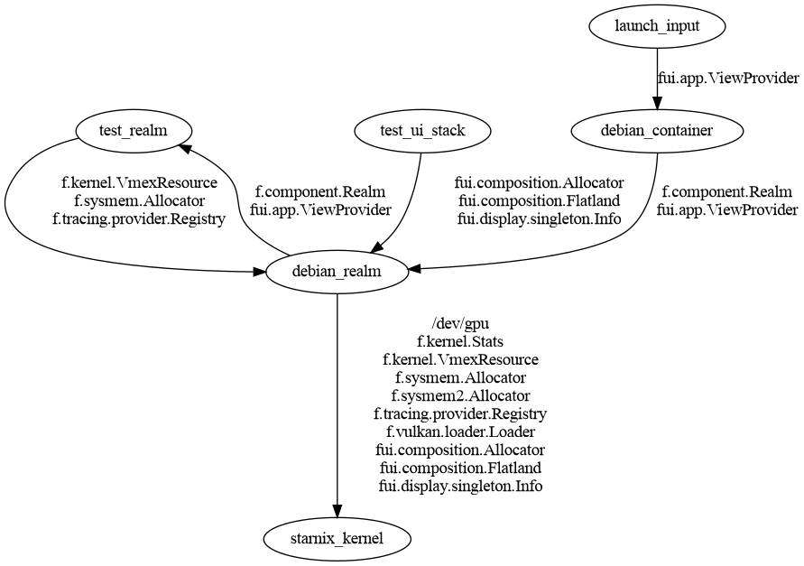

## Overview

This test exercises the touch input dispatch path from Input Pipeline to a Scenic client. It is a multi-component test, and carefully avoids polling for component coordination.

- It runs real Scene Manager and Scenic components.
- It uses a fake display controller; the physical device is unused.

### Components involved

- [starnix-touch-test.cc](starnix-touch-test.cc): Instantiates the component hierarchy,
  injects touch events, reads back events from the `evdev` client running under
  Starnix
- Scene Manager: Unmodified Fuchsia component; also referred to as Input Pipeline, for its
  role in routing input events
- Scenic: Unmodified Fuchsia component
- Starnix

  - [debian_realm](ui-client/meta/debian_realm.cml): The root of the Starnix subtree
    within the component hierarchy. Instantiates the Starnix kernel and the `debian_container`, and sets up the `starnix_kernel_env` needed for the Starnix kernel to be the runner for `debian_container`.

    All of this machinery lets us run software from a [Debian](https://debian.org) image.
    For details of which image is used, see the `debian_container_component` target
    in [ui-client/BUILD.gn](ui-client/BUILD.gn).

    This test uses the Debian image, because it's readily available in the Fuchsia
    tree. However, the test does not have any specific dependency on Debian, beyond
    the fact that Debian provides `.so` files needed to run a Linux C++ program.

    In particular, the test does not depend on, e.g., daemons in Debian that create
    device nodes in response to `udev` events.

  - [debian_container](ui-client/meta/debian_container.cml): The Linux userspace that
    is run by the Starnix kernel. This provides a shell environment (e.g. `/bin/sh`),
    runs the `launch_input` program to initialize Starnix input, and runs the
    `touch_dump` program to relay `evdev` data back to `starnix-touch-test.cc`.
  - [launch_input](ui-client/meta/launch_input.cml): This program triggers the
    initialization of Starnix input.
    - The C++ source code is trivial, as the main requirement is just to have some
      component that needs input, and keeps running.
    - The magic is in the CML file. By requiring the `framebuffer` feature,
      `launch_input` forces Starnix to initialize its input code.
    - When we refactor Starnix graphics and input, so that the `framebuffer`
      feature is associated with a kernel, rather than with components running
      under Starnix, this program can go away.
  - [touch_dump](ui-client/touch_dump.cc): The `evdev` client. This reads touch
    events from `/dev/input/event0`, parses the `struct input_event` records
    read from that device, and prints them out in a simple text format.

### Touch dispatch path

- `starnix-touch-test.cc` -> Input Pipeline -> Scenic -> Starnix kernel -> touch_dump

### Setup sequence

1. `starnix-touch-test.cc` sets up this view hierarchy:
   - Top level scene, owned by Scene Manager.
   - Child view, owned by Starnix.
1. `starnix-touch-test.cc` waits for a Scenic event that verifies Starnix has UI content
   in the scene graph.
1. `starnix-touch-test.cc` injects input into Input Pipeline, emulating a display's touch
   report.
1. Input Pipeline dispatches the touch event to Scenic.
1. Scenic dispatch the touch event to the Starnix kernel.
1. Starnix kernel receives the touch event from Scenic.
1. `touch-dump.cc` reads the event from the Starnix kernel using the `evdev` protocol.
1. `touch-dump.cc` reports the event details back to `starnix-touch-test.cc` over
   a Zircon datagram socket.
1. `starnix-touch-test.cc` validates the contents of the event.

### Capability routes

Here are some of the capability routes configured in this test. This is by no means
comprehensive. It just focuses on the routes that are apparent from the source
code in this directory.



### Synchronization

The input devices will be present in the container by the time Linux code is running. The
input handling threads will also have been spawned before init runs.

## Build the test

```shell
$ fx set core.x64 --with //src/ui/tests/integration_input_tests/starnix-touch:tests
```

## Run the test

To run the fully-automated test, use this fx invocation:

```shell
$ fx test starnix-touch-test
```
